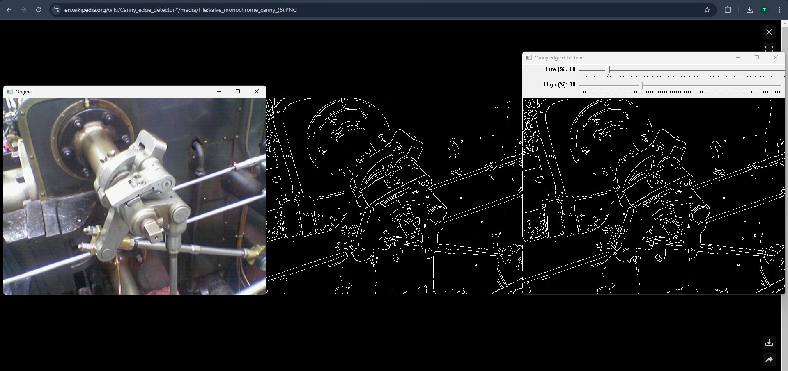

# What is this?
Canny edge detection implemented in CUDA C/C++. Supports images and video. OpenCV is used for loading and writing media. Compiled for CUDA compute capability 8.9 (compute_89, sm_89) and tested on RTX 4060.

Comparison with an example from the [article](https://en.wikipedia.org/wiki/Canny_edge_detector#):


# Configuration
* headless - `true` for just writing output files, `false` for GUI
* media - `image` or `video`
* in - input path
* lowThreshold, highThreshold - percentages for retaining or discarding edges based on pixel values

# Edge Detection using CUDA and Python

This project demonstrates edge detection using a naive algorithm implemented in CUDA. It also combines multiple detection methods in one script for comparative analysis.

## How to Run

1. **Run Naive Algorithm:**  
   To perform edge detection using the naive algorithm, execute the following script:  
   ```bash
   python pycuda_detection_new(1).py
   ```

2. **Run All Detection Methods:**  
   To run all edge detection methods together, execute:  
   ```bash
   python pycuda_combined_new.py
   ```

## Requirements

Ensure the following dependencies are installed on your system:

- **CUDA Toolkit**: Required for GPU-accelerated computation.  
- **Keras**: For machine learning-related processing.  
- **TensorFlow**: Backend for Keras and additional processing.  

## Notes

- Make sure your environment is properly configured to support CUDA.  
- Use Python 3.7+ for compatibility with the scripts.  


